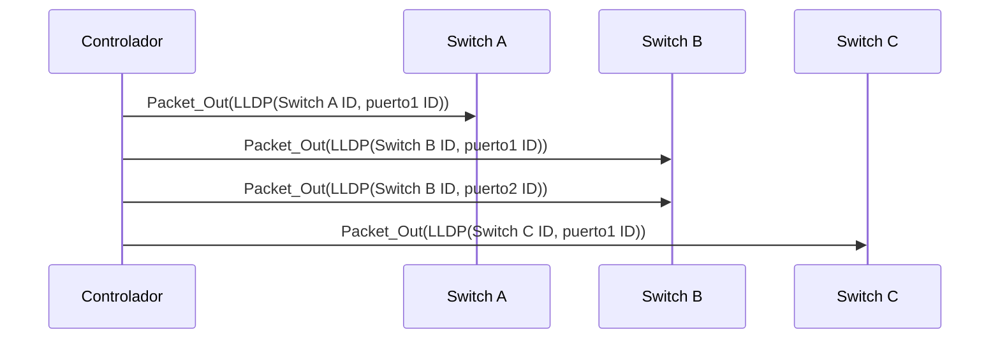
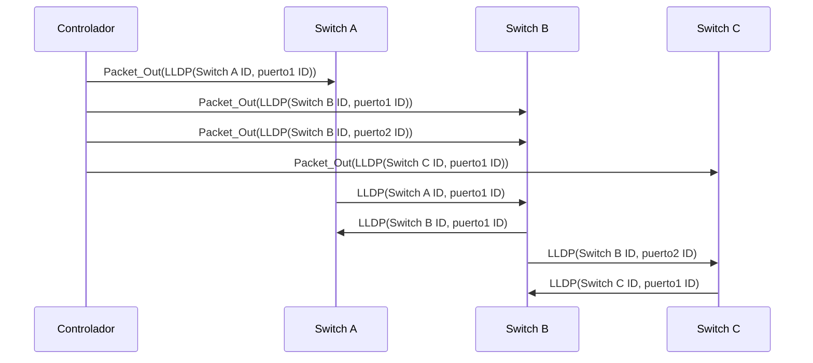
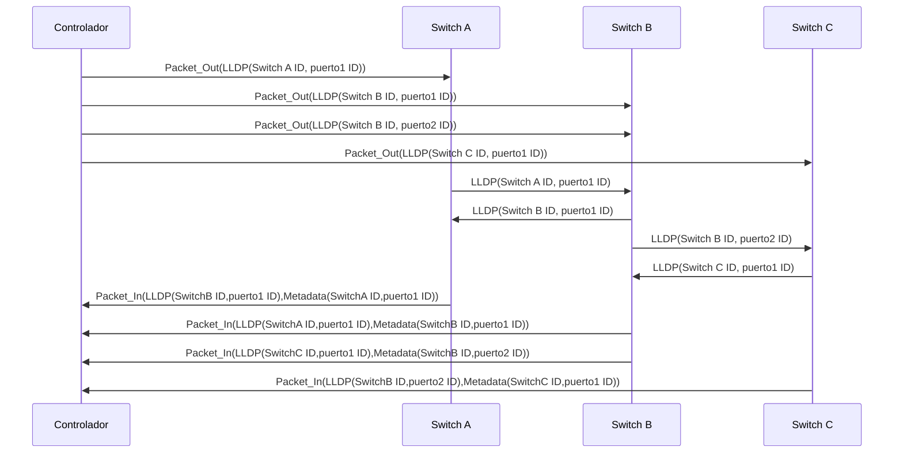

Link Layer Discovery Protocol.

<!--more-->

# LLDP y SDN

En las redes definidas por software el controlador tiene la responsabilidad de descubrir la topología de red así como de mantenerla actualizada. Para ello existen múltiples soluciones. Dependiendo del entorno se tiene que unas soluciones son válidas y otras no. Cuando en la red en la que se encuentra el controlador (o cluster de controladores) es puramente SDN una solución para descubrir la topología es usar LLDP.

# Qué es LLDP?

LLDP es un protocolo de capa 2 que sirve para obtener la topología de una red. Es un protocolo en el que no hay mensajes del tipo pregunta-respuesta sino que solo hay un tipo de mensajes de tipo "anuncio". Este aspecto es importante porque en la práctica se traduce en que para obtener la topología de una red usando este protocolo va a ser necesario tener un agente que interrogue a los dispositivos sobre su estado para que con esta información pueda se pueda tener una topología de la red. En es caso de SDN este agente es el controlador e interroga a los dispositivos a través de mensajes Packet-In y Packet-Out.

# Ejemplo del protocolo LLDP en una red SDN

En un primer instante inicial los dispositivos de una red SDN tienen configurada una dirección IP del controlador (o varias en caso de un cluster de controladores) y además los dispositivos tienen una regla en su tabla de flujos que específica para que los paquetes que tengan un "EtherType" con valor 0x88cc sean reenviados al controlador a través de un mensaje Packet-In (los mensajes Packet-In se definen en la sección 6.1.2 de la [especificación OpenFlow](https://3vf60mmveq1g8vzn48q2o71a-wpengine.netdna-ssl.com/wp-content/uploads/2014/10/openflow-switch-v1.5.1.pdf)).

<html>
<head>
<title>arquitectura_SDN</title>
<meta charset="utf-8"/>
</head>
<body>

</body>
</html>

Así los dispositivos de red realizarán inicialmente el handshake con el controlador a través de una conexión cifrada (TLS) para enviar y recibir parámetros de configuración. Entre los datos que le proporcionan los dispositivos de red al controlador se encuentran los parámetros que necesita el controlador para descubrir los enlaces de los dispositivos de red. Por ejemplo le envía la lista de sus puertos con sus respectivas direcciones MAC o su ID. Llegados a este punto el controlador ya conoce los dispositivos de red que se encuentran en la red.

A partir de ahora el controlador deberá conocer como están conectados los switches. Para ello el siguiente paso que da el controlador es enviar a cada switch un paquete LLDP encapsulado en un mensaje Packet-Out por cada puerto activo que hay en cada switch. Un detalle muy importante es que la MAC de destino de los paquetes LLDP es una MAC broadcast definida en el estándar 802.1AB como multicast (01:80:C2:00:00:0E).

Este mensaje Packet-Out también va a instalar las correspondientes entradas en la tabla de flujos de cada dispositivo de red para enrutar cada mensaje LLDP a través del puerto indicado en el campo TLV del payload del mensaje LLDP. De esta manera cuando un dispositivo de red recibe un mensaje LLDP enviado por el controlador, este lo reenvía por el ID de puerto apropiado (TLV) a los dispositivos de red adyacentes. El payload de LLDP incluye varios campos (unos obligatorios y otros opcionales) como el ID de Chassis o el ID de puerto. Lo importante es que con la información que incluye el payload describe al dispositivo de red que envió el mensaje LLDP.  

Ahora cuando un switch recibe los mensajes por un puerto que no es el del controlador, los switches adyacentes encapsulan el paquete en un mensaje Packet-IN y lo envían al controlador. En este mensaje se incluyen metadatos como el ID del Switch, el Puerto por el que se recibió el paquete LLDP, entre otros.

Después de recibir estos Packet-In, el controlador es capaz de descubrir los enlaces entre dos switches OF, basándose en la información contenida en la PDU de LLDP y los datos extraidos de los metadatos. El controlador almacena esta información en la base de datos y a partir de este momento realizará actualizaciones sobre esta base de datos.

Este proceso se repite todos y cada uno de los switches disponibles en la red. Además el proceso entero de descubrimiento de la topología se realiza periódicamente en ciclos de 5 segundos.

Este proceso de descubrimiento de red en redes puramente SDN no está estandarizado. El uso del protocolo de descubrimiento LLDP es heredado de la primera implementación de un controlador OpenFlow (NOX).

La principal limitación del protocolo LLDP es que solo descubre enlaces entre switches adyacentes, lo que tiene un gran y serio impacto en redes híbridas. Esto hace que se pierdan paquetes LLDP cuando hay enlaces entre switches que no soportan OpenFlow, por ejemplo el controlador no puede descubrir todos los enlaces del dominio administrativo si existen switches que trabajan de manera tradicional. Por este motivo se necesita una aproximación diferente para descubrir la topología en una red compuesta por switches tradicionales y switches OF.

# Resumen

* El EtherType en los mensajes LLDP es 0x88cc
* Los switches no reenvían mensajes LLDP
* Un switch solo recibe los mensajes LLDP enviados por switches que se encuentran directamente conectados a él
* Los mensajes LLDP se envían a una dirección MAC multicast filtrada por bridges (01:80:C2:00:00:0E)

# Referencias

[1] [Especificación Openflow](https://3vf60mmveq1g8vzn48q2o71a-wpengine.netdna-ssl.com/wp-content/uploads/2014/10/openflow-switch-v1.5.1.pdf)

[2] [802.1AB - Station and Media Access Control Connectivity Discovery](http://standards.ieee.org/findstds/standard/802.1AB-2016.html)

