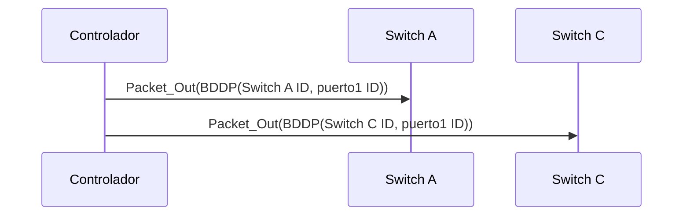
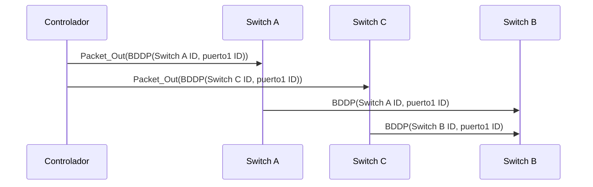
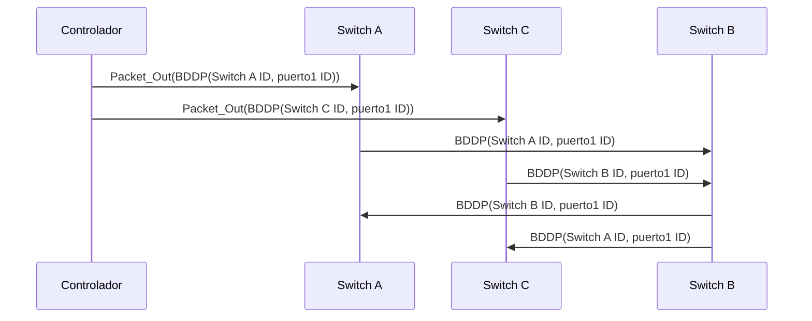
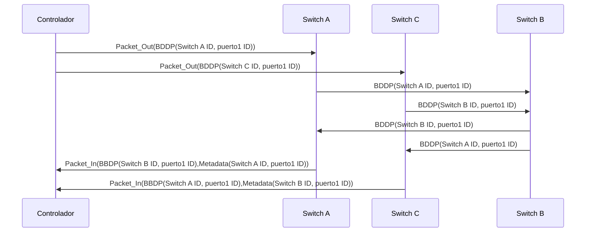

Broadcast Domain Discovery Protocol

<!--more-->

# Limitaciones de LLDP en SDN.

En una red híbrida en donde existen elementos de red con OpenFlow y elementos de red tradicionales que no soportan o no tienen activado OpenFlow aparecen dos tipos de enlaces:
1. Enlaces directos entre switches que sopotan OpenFlow.
2. Enlaces entre switches OpenFlow con switches tradicionales en el medio.
	
Esto presenta un problema si se usa LLDP, ya que el protocolo LLDP es un protocolo de un solo salto y los paquetes LLDP van a ser procesados y  descartados automáticamente por los switches tradicionales. Además no existe el handshake inicial con estos nodos (en el que el controlador obtiene información sobre los puertos activos del switch). Por estas razones se hace necesario otro método para descubrir la topología de red, y una opción en estas redes es utilizar el protocolo BBDP.

# BBDP 

Los mensajes BDDP presentan la misma estructura que los paquetes LDDP (tiene campos TLV obligatorios y opcionales). La diferencia clave está en el campo de MAC destino (ff:ff:ff:ff:ff:ff) en contraste con las direcciones usadas por el protocolo LLDP (01:80:C2:00:00:0E). Esta característica permite que los switches tradicionales reenvíen los mensajes BDDP solucionando así el problema de "un solo salto" en LLDP. Con esta aproximación, se pueden descubrir enlaces entre switches OpenFlow con switches tradicionales en el medio. Otra diferencia importante es el campo "EtherType" en la cabecera BDDP, este protocolo utiliza generalmente el valor 0x8999.

# Ejemplo red SDN con BBDP

<html>
<head>
<title>arquitectura_SDN_BBDP</title>
<meta charset="utf-8"/>
</head>
<body>

</body>
</html>

En el handshake inicial, el controlador obtiene la lista puertos activos en dispositivos OpenFlow de la red (Switch A puerto 1 y Switch C puerto 1). Para descubrir enlaces indirectos a través de switches tradicionales, el controlador encapsula por cada puerto activo de cada switch, un mensaje BDDP dentro de un Packet-Out y lo envía a la red. Enviando un Packet-Out se incluye una entrada en la tabla de cada switch OF que recibe el mensaje.Después de procesar el paquete BDDP, el switch OpenFlow reenvía el mensaje a los switches vecinos a través del ID puerto indicado en el campo TLV. Este paquete incluye los mismos parámetros que reconocen a un switch en BDDP o LLDP ( ID de Switch , ID de puerto,...).

Ahora el switch vecino puede ser un switch que soporta OpenFlow o un switch tradicional. En el primer caso el paquete va a coincidir con el campo "EtherType" 0x8899 y el mensaje va a ser enviado directamente al controlador vía un Packet-In. La información que identifica el puerto del switch OpenFlow vecino será recibida en los metatados del mensaje BDDP (de manera similar a como se hace en LLDP).

En el caso de que el vecino sea un switch tradicional, este va a examinar la dirección MAC del paquete. Así, este se dará cuenta de que es una dirección broadcast y reenviará el paquete por todos los puertos (excepto por el que lo recibió). 

Cuando uno de estos paquetes BDDP que reenvía el switch tradicional llegue a un switch openflow, este va a enviar el paquete vía Packet-In al controlador. Este mensaje Packet-In y sus metadatos, le dan al controlador la información al controlador para determinal que existe un enlace entre switches OpenFlow con switches tradicionales en medio.

Después de completar este procedimiento el controlador tiene dos paquetes BDDP recibidos vía Packet-In con la información entre dos switches OpenFlow con los que es capaz de determinar que existe un switch tradicional en el medio.

# Resumen 

- El EtherType de los mensajes BBDP es  0x8999.
- Los mensajes BBDP se envían a una dirección MAC multicast (ff:ff:ff:ff:ff:ff)
- Los switches reenvían mensajes BBDP

